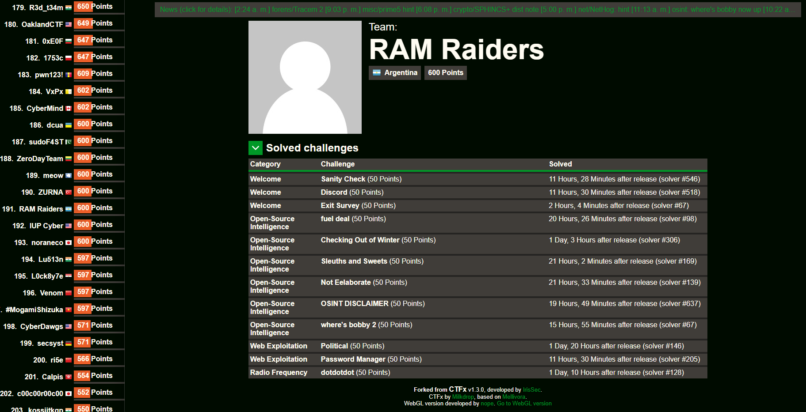

# Iris CTF 2025
The writeups in this repository correspond to the **Iris CTF 2025** event, organized by [IrisSec](https://irissec.xyz/), held from 01/04/2024 to 01/06/2024.

## Event Details
- CTFtime event URL: https://ctftime.org/event/2503/
- Event URL: https://2025.irisc.tf/

---

The following challenges were solved:

| Challenge | Category |
| --- | :---:
| ✅ Fuel Deal | Open-Source Intelligence |
| ✅ Checking Out of Winter | Open-Source Intelligence |
| ✅ Sleuths and Sweets | Open-Source Intelligence |
| ✅ Not Eelaborate | Open-Source Intelligence |
| ✅ Where's bobby 2 | Open-Source Intelligence |
| ✅ Political | Web Exploitation |
| ✅ Password Manager | Web Exploitation |
| ✅ dotdotdot | Radio Frequency |

Team URL: https://2025.irisc.tf/user?id=812

## Challenge Assets
All challenge assets are archived in the official repository. You can find them at: https://github.com/IrisSec/IrisCTF-2025-Challenges
