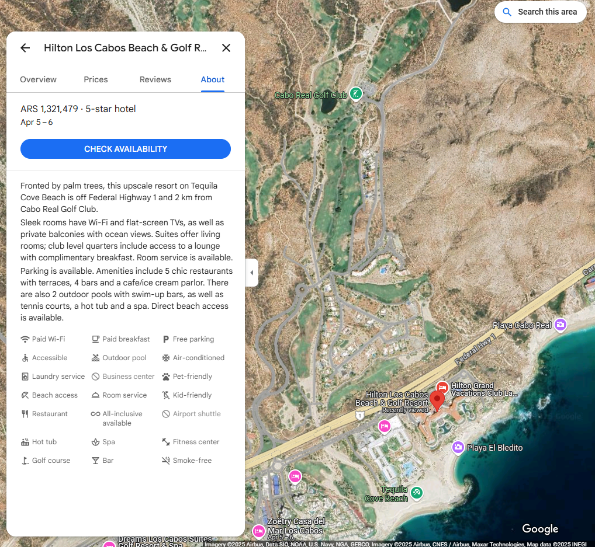

# Checking Out of Winter - OSINT
We took our annual road trip to Baja California Sur to visit the beach and play some golf. I like how this location is farther from the city compared to other resorts. I really enjoyed the sweet and savory sauce on the pizza with shredded chicken. After eating, I fell asleep, and half of my legs ended up getting tanned. https://osint-food-blog-web.chal.irisc.tf/


Question: Which hotel did Adam stay at?

## Solution Path

### Initial Clues Analysis
1. Location is in Baja California Sur
2. Property features:
   - Remote location away from city center
   - Access to golf facilities or proximity to a golf course
   - Pool area with dining service
3. Restaurant details:
   - Serves pizza
   - Notable dish: Pizza with shredded chicken and sweet/savory sauce

### Investigation Process
1. Used Google Maps to search for resorts in [Baja California Sur](https://maps.app.goo.gl/UuLTxCXVrpwDR4Eg9)
2. Filtered results to focus on properties away from major cities
3. Looking at photos, located a hotel with a design matching the photo provided
4. It is located off Federal Highway 1 and 2 km from Cabo Real Golf Club.



## Flag
```
Flag: `irisctf{Hilton_Los_Cabos_Beach_and_Golf_Resort}`


