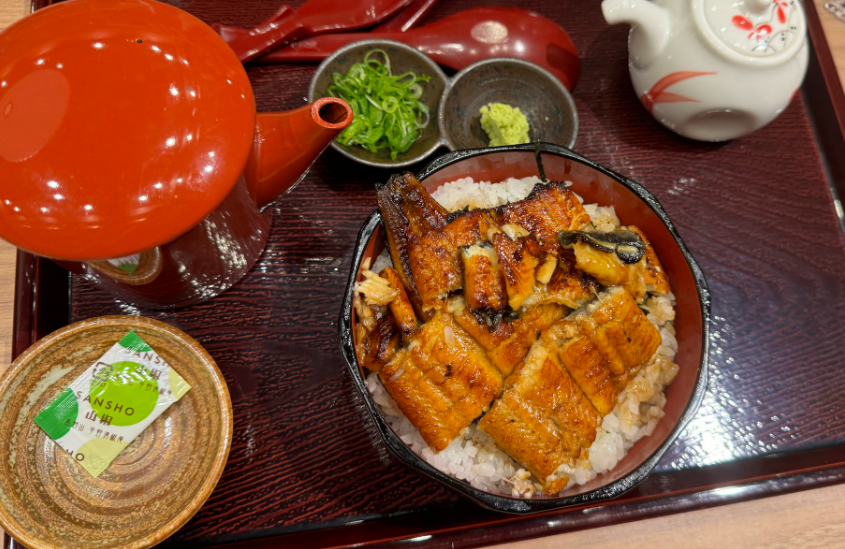
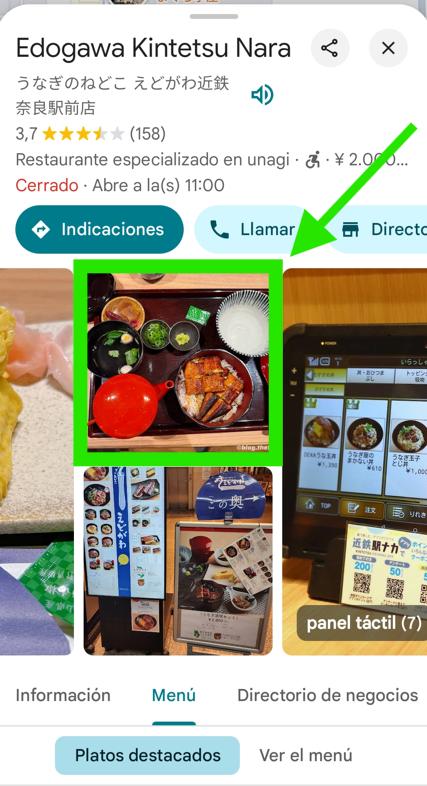

# Not Eelaborate - OSINT Challenge Writeup

## Challenge Description
CHALLENGE'S DISCLAIMER: Please do not include any accent markings or special characters into the flag. Apply proper capitalization to the flag.

After my long train ride, I visited a deer park and got to feed the wildlife. There were so many restaurants to choose from but I was craving eel. I really like the soup mixed in with the rice and fish. The wasabi threw me off since I don’t normally have it served this way.

I would recommend this place if you want to find a quiet restaurant to eat at, and wouldn’t mind finding a few small fish bones. Eels are known to carry lots of tiny bones it’s inevitable that you’ll find it in a lot of places. https://osint-food-blog-web.chal.irisc.tf/

Question: What is the full name of the restaurant?



## Solution Path

### Initial Analysis
1. Key clues from challenge:
   - Location is near a deer park in Japan
   - Restaurant serves unagi (eel) dishes
   - Distinctive plating style visible in image

### Investigation Process
1. **Location Narrowing**
   - Researched deer parks in Japan
   - Identified Nara Park as the most prominent deer park

2. **Restaurant Search**
   - Performed reverse image search (Google Images) using:
     - Search terms: "Unagi Dish Restaurant near Nara Park"
   - Found matching dish presentation at [Edogawa Kintetsu Nara](https://maps.app.goo.gl/d2VqjxsCzop5jx1y6)

3. **Verification**
   - Confirmed menu items and plating style
   - Verified proximity to Nara Park



## Flag
```
irisctf{Edogawa_Kintetsu_Nara}
```

