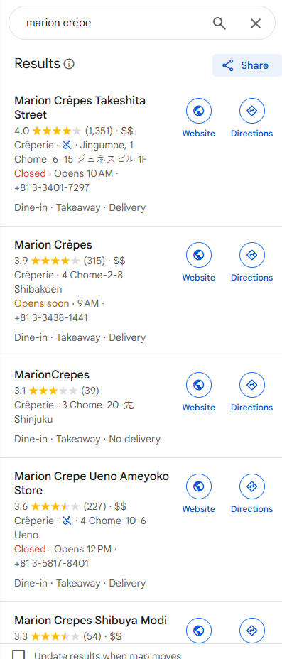

# Sleuths and Sweets - OSINT

CHALLENGE'S DISCLAIMER: Here’s an example of the address format {3_Chome_12_8_Azabu_Minato}. Please do not include any accent markings or special characters into the flag. Apply proper capitalization to the flag.

I visited my friend in Japan, and we had some alright crepes! The area had a lot of foot traffic, so we expected a long wait, but it was worth it. I’m usually not a fan of yogurt in my crepe, but it still tasted pretty alright. https://osint-food-blog-web.chal.irisc.tf/

Question: What is the address of this location?

## Solution

A reverse image search suggested that the crepe shop was a Marion Crêpes store. However, there are many Marion Crêpes locations.



Since the description mentioned a high-traffic area, I refined my search to Shibuya Crossing—one of the world's busiest pedestrian crossings, where up to 3,000 people cross at once during peak times.

After checking several stores, I finally identified the correct one by matching its surroundings, such as a bank sign.

[Marion Crepes Shibuya Modi](https://maps.app.goo.gl/EREaSUNRKeXapscB7)

## Flag
```
Flag: irisctf{1_Chome_21_3_Jinnan_Shibuya}
```


