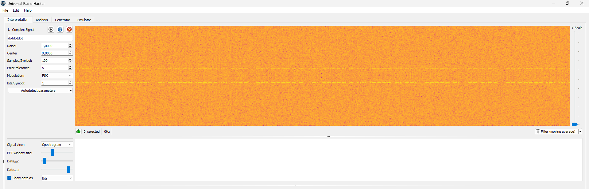
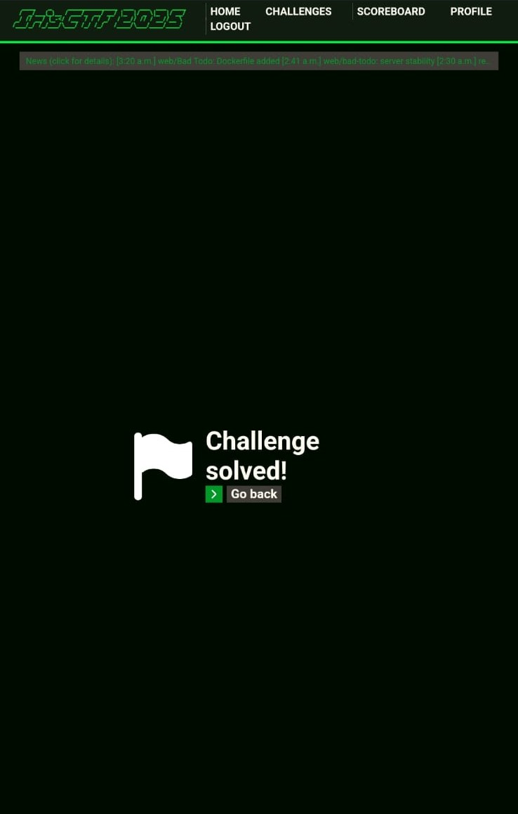

# dotdotdot - Radio Frequency

## Challenge Description
I picked up this transmission, but it's way too noisy to make any sense of it. Can you give it a shot?

**Flag format:** `irisctf{th3_m3ss4ge}` in all lowercase. Replace spaces with underscores. Add curly braces.

## Solution

1. **Open the File with Universal Radio Hacker**
    - I used [Universal Radio Hacker (URH)](https://github.com/jopohl/urh) to open the provided file.
    - URH is a powerful tool for analyzing and decoding radio signals.

2. **View the Spectrogram**
    - Once the file was loaded in URH, I viewed the spectrogram to visualize the signal.
    - The spectrogram helped identify the presence of Morse code in the transmission.

    

3. **Translate the Morse Code**
    - I translated the Morse code from the spectrogram using https://morsecodetranslator.com/.

4. **Format the Flag**
    - According to the flag format, I replaced spaces with underscores and added curly braces.

## Flag
```
Flag: irisctf{n01s3_g0t_n0th1ng_0n_my_m0rse}
```


