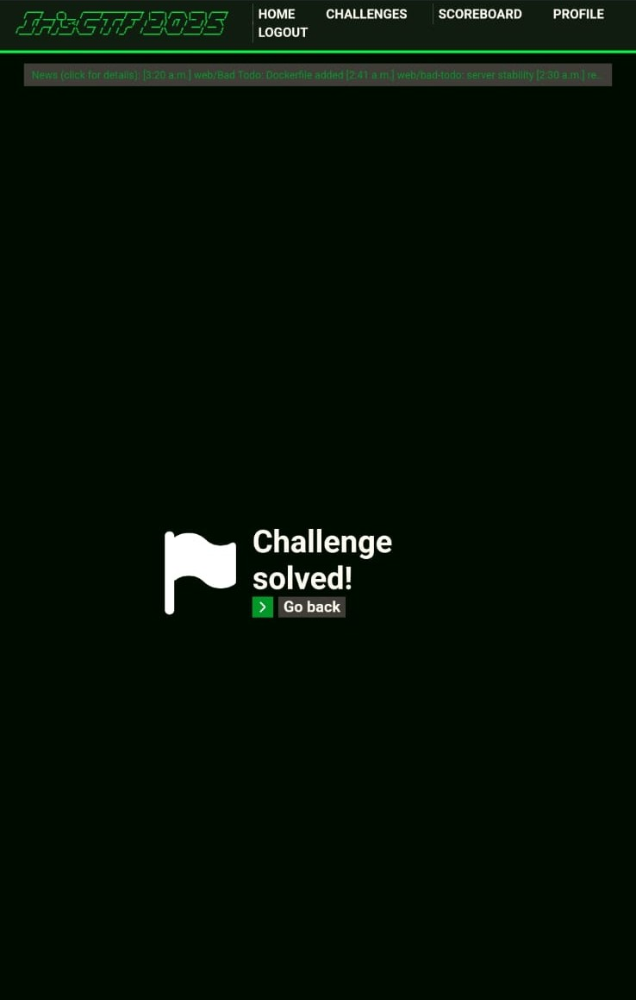

# Political - Web
## Challenge Description
My new enterprise policy ensures you will remain flag-free.
- **Hint**: "The admin bot replying with 'timeout' does not mean the bot is malfunctioning; just that the page render timed out after the defined time limit."

## Technical Analysis

### Components Overview
1. **Web Application** (Flask-based):
   - Endpoint for flag retrieval
   - Token management system
   - Admin authentication mechanism

2. **Admin Bot** (Puppeteer-based):
   - Accepts URLs via netcat
   - Implements URL filtering
   - Has admin privileges
   - It uses a **Security Policy** (Chrome Policy). This policy implements URL filtering at the browser level:
        - Blocks paths containing "giveflag"
        - Blocks URLs with "token" parameter
        - Uses wildcard (*) matching for flexible pattern matching
   ```json
   {
       "URLBlocklist": ["*/giveflag", "*?token=*"]
   }
   ```

### Application Architecture

#### Token System
1. **Token Generation**:
   - Implements `secrets.token_hex(16)` for secure token generation
   - Stores tokens in `valid_tokens` dictionary
   - Initial token state is `False`

2. **Token Validation**:
   - Requires admin cookie presence
   - Validates token existence in `valid_tokens`
   - Updates token state to `True` upon successful admin validation

## Vulnerability Analysis

### Security Controls
1. **URL Filtering**:
   - Chrome Enterprise Policy blocks specific patterns
   - Implementation uses simple string matching
   - No handling of encoded values

2. **Token Validation**:
   - Two-step validation process
   - Requires admin interaction
   - Token state management

### Bypass Strategy
**Double Encoding Technique**:
- Target specific letters: 'g' in "giveflag" and 't' in "token"
- Encode these letters:
     ```
     g -> %67
     t -> %74
     ```
- Result: `/%67iveflag?%74oken=<token>`

### Exploitation Process
1. **Token Acquisition**:
   - Request token from `/token` endpoint
   - Store token value

2. **Policy Bypass**:
   - Construct encoded payload
   - Submit to admin bot
   - Bot visits URL with admin privileges
   - Token gets marked as valid

3. **Flag Retrieval**:
   - Submit token to `/redeem`
   - Receive flag

## Flag
```
irisctf{flag_blocked_by_admin}
```


